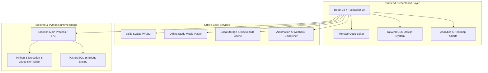

<div align="center">


# Ap Desktop

### Interview Preparation & Coding Practice Platform

A premium, offline-first Windows desktop app for mastering **Data Structures, Algorithms, SQL, and PostgreSQL**.


</div>

---

## Screenshots

| Login | Overview |
| :---: | :---: |
|  |  |

| Problems | Python Practice |
| :---: | :---: |
|  |  |

| SQL Studio | PostgreSQL Lab |
| :---: | :---: |
|  |  |

| To-Do |
| :---: |
|  |

---

## Features

| Feature | Description |
| :--- | :--- |
| 🔒 **Anti-Cheat Practice Mode** | Blocks clipboard operations in the Monaco Editor (`Ctrl+V`, `Cmd+V`, context-menu paste) so you build real muscle memory and syntax recall. |
| 🐘 **PostgreSQL 16 Lab** | pgAdmin-style explorer tree, live inline cell editing, dataset import (`.csv`, `.xlsx`, `.json`, `.sql`) and one-click `CSV` / `XLSX` export. |
| ⚡ **SQL Studio (SQLite WASM)** | Instant in-memory SQL execution on realistic production schemas, with query plan insights and real-time syntax checking. |
| 🎵 **Tamil Study Music** | Fully offline focus music: veena, flute, soft piano, ambient and lo-fi instrumental tracks. |
| 📅 **52-Week Activity Heatmap** | Rolling calendar of daily submissions and study streaks. |
| 🤖 **Automation & Webhooks** | Event dispatch to Telegram Bot, Twilio SMS/WhatsApp, Google Sheets and Windows Toast notifications, with offline resilience. |
| 🛡️ **Signed Installer** | SHA-256 Authenticode signature with RFC 3161 timestamping for a smooth Windows install. |

---

## Tech Stack

| Layer | Technologies |
| :--- | :--- |
| **Frontend** | React 18, TypeScript, Tailwind CSS, Monaco Editor, Recharts |
| **Offline services** | sql.js (SQLite WASM), LocalStorage, IndexedDB, offline audio player, webhook dispatcher |
| **Desktop bridge** | Electron (main process + IPC), Python 3 judge, PostgreSQL 16 bridge |
| **Quality** | Vitest-style test suite (54 tests), TypeScript type checking |
| **Packaging** | Inno Setup 6, Electron NSIS, PowerShell build and signing scripts |

---

## Architecture



---

## Getting Started

### Prerequisites

- **Node.js** v18.x or v20.x
- **Python** 3.10+ (Python judge and PostgreSQL worker)
- **PostgreSQL 16** (optional, only for the genuine PostgreSQL lab)

### Install and Run

```powershell
# 1. Clone and install
git clone https://github.com/arun-pandian-p/Self_learn-desktop-application.git
cd Self_learn-desktop-application
npm install

# 2. Type check and run tests
npm run typecheck
npm test

# 3a. Desktop development mode
npm run electron:dev

# 3b. Or web preview mode
npm run dev
```

---

## Production Build & Release

```powershell
# 1. Quality gate (type check + 54 tests)
npm run typecheck
npm test

# 2. Build the production frontend bundle
npm run build

# 3. Build the Inno Setup 6 installer
powershell -ExecutionPolicy Bypass -File .\scripts\build-installer.ps1 -SkipFrontendBuild

# 4. Sign (SHA-256 Authenticode) and unblock for SmartScreen
powershell -ExecutionPolicy Bypass -File .\scripts\sign-and-unblock.ps1
```

### Release Targets

| Target | Output Path | Description |
| :--- | :--- | :--- |
| **Inno Setup 6 Installer** *(recommended)* | `release\installer\Ap_Setup_v1.0.0_x64.exe` | Compact standalone Windows setup wizard |
| **Electron NSIS Installer** | `release\Ap-Setup-1.0.0-x64.exe` | Standard Electron installer with auto-update support |
| **Portable Build** | `release\win-unpacked\Ap.exe` | Zero-install standalone executable |

---

## Testing

The repo ships with a 54-test suite across all core subsystems:

```text
✓ tests/license.test.ts              (4 tests)
✓ tests/study-music.test.ts          (7 tests)
✓ tests/notifications.test.ts        (4 tests)
✓ tests/sql-runner.test.ts           (4 tests)
✓ tests/sandbox.test.ts              (4 tests)
✓ tests/electron-ipc.test.ts         (5 tests)
✓ tests/phase-enhancements.test.ts   (4 tests)
✓ tests/curriculum-import.test.ts    (7 tests)
✓ tests/profile-submissions.test.ts  (10 tests)
✓ tests/postgres.test.ts             (5 tests)

Test Files  10 passed (10)
     Tests  54 passed (54)
```

```powershell
npm test
```

---

## Keyboard Shortcuts & Practice Rules

| Shortcut / Action | Scope | Behavior |
| :--- | :--- | :--- |
| `Ctrl + Enter` / `Cmd + Enter` | Monaco Editor | Run code / submit solution |
| `Ctrl + S` / `Cmd + S` | Practice Mode | Save code draft locally |
| `Ctrl + V` / `Ctrl + C` | Practice Mode editor | **Blocked** to enforce manual typing |
| `Double-click cell` | PostgreSQL table view | Edit inline and dispatch `UPDATE` |
| `Space` | Study Music Player | Play / pause current track |

---

## Roadmap

- [ ] v1.1: bug fixes and stability improvements
- [ ] Refactors for cleaner OOP structure and LLD
- [ ] More problems and curriculum content

---

## License & Credits

Designed and developed by **Ap Software Technologies** ([Arun Pandian](https://github.com/arun-pandian-p)).

All bundled focus music and curriculum datasets are licensed for offline redistribution.
