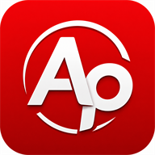
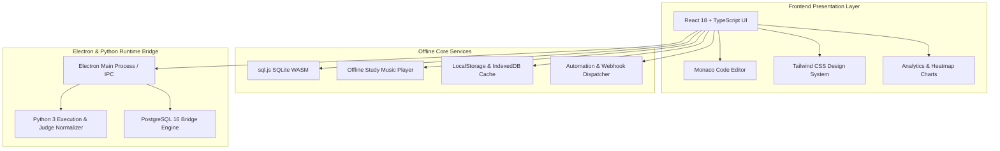

# Ap Desktop — Interview Preparation & Coding Practice Platform

<p align="center">
  
  <br />
  <strong>A premium, offline-first Windows desktop platform for mastering Data Structures, Algorithms, SQL, and PostgreSQL.</strong>
  <br />
  <sub>Version 1.0.0 | Windows x64 | Built with React, TypeScript, Monaco Editor, sql.js & Electron</sub>
</p>

---

## 🌟 Product Highlights

- **🔒 Anti-Cheat Practice Mode**: Intercepts clipboard operations (`Ctrl+V`, `Cmd+V`, context menu paste) within the Monaco Editor to enforce pure muscle memory and authentic syntax learning.
- **🐘 PostgreSQL 16 Genuine Lab**: Complete pgAdmin-style database explorer tree with live inline table cell editing, dataset importing (`.csv`, `.xlsx`, `.json`, `.sql`), and 1-click `CSV`/`XLSX` export.
- **⚡ SQLite In-Memory SQL Studio**: Instant browser/WASM SQL execution against realistic production schemas with query plan insights and real-time syntax checking.
- **🎵 Tamil Study Music Suite**: Built-in, 100% offline background focus music with licensed Tamil instrumental veena, flute, soft piano, ambient, and lo-fi tracks.
- **📅 Rolling 52-Week Activity Heatmap**: Continuous activity calendar tracking daily submissions and study streaks dynamically ending in the active month.
- **🤖 Automation Scheduler & Webhooks**: Multi-channel event dispatchers supporting Telegram Bot, Twilio SMS/WhatsApp, Google Sheets, and Windows Toast Notifications with offline resilience.
- **🛡️ Authenticode Signed & Unblocked**: Pre-signed with SHA-256 Authenticode digital certificate and RFC 3161 timestamping for smooth Windows installation.

---

## 📐 Architecture Overview



---

## 🚀 Quick Start & Development

### Prerequisites
- **Node.js**: v18.x or v20.x
- **Python**: v3.10+ (for Python judge execution and PostgreSQL worker)
- **PostgreSQL 16**: (Optional, for genuine PostgreSQL lab features)

### Installation & Launch

```powershell
# 1. Clone repository and install dependencies
git clone https://github.com/arun-pandian-p/Self_learn-desktop-application.git
cd ap
npm install

# 2. Run TypeScript check & test suite
npm run typecheck
npm test

# 3. Launch in Desktop Development Mode
npm run electron:dev

# Or launch Web Preview mode
npm run dev
```

---

## 📦 Production Build & Release Pipeline

The application follows the standardized build, packaging, and signing procedures defined in [`SKILL.md`](file:///c:/Users/Rishi/OneDrive/Desktop/ap/SKILL.md):

```powershell
# Step 1: Quality Gate & Test Suite (54 Tests)
npm run typecheck
npm test

# Step 2: Compile Production Frontend Bundle
npm run build

# Step 3: Compile Inno Setup 6 Native Installer
powershell -ExecutionPolicy Bypass -File .\scripts\build-installer.ps1 -SkipFrontendBuild

# Step 4: SHA-256 Authenticode Signing & SmartScreen Unblocking
powershell -ExecutionPolicy Bypass -File .\scripts\sign-and-unblock.ps1
```

### Release Distribution Targets

| Target Executable | Output Path | Description |
| :--- | :--- | :--- |
| **Inno Setup 6 Native Installer** | `release\installer\Ap_Setup_v1.0.0_x64.exe` | Recommended ultra-compressed standalone Windows setup wizard |
| **Electron NSIS Installer** | `release\Ap-Setup-1.0.0-x64.exe` | Standard Electron NSIS auto-updating installer |
| **Portable Binary Package** | `release\win-unpacked\Ap.exe` | Zero-install standalone desktop executable |

---

## 🧪 Test Verification Suite

The repository includes a comprehensive 54-test verification suite covering all core subsystems:

```
✓ tests/license.test.ts (4 tests)
✓ tests/study-music.test.ts (7 tests)
✓ tests/notifications.test.ts (4 tests)
✓ tests/sql-runner.test.ts (4 tests)
✓ tests/sandbox.test.ts (4 tests)
✓ tests/electron-ipc.test.ts (5 tests)
✓ tests/phase-enhancements.test.ts (4 tests)
✓ tests/curriculum-import.test.ts (7 tests)
✓ tests/profile-submissions.test.ts (10 tests)
✓ tests/postgres.test.ts (5 tests)

Test Files  10 passed (10)
     Tests  54 passed (54)
```

Run test suite:
```powershell
npm run test
```

---

## ⌨️ Keyboard Shortcuts & Practice Mode Rules

| Shortcut / Action | Scope | Behavior |
| :--- | :--- | :--- |
| `Ctrl + Enter` / `Cmd + Enter` | Monaco Editor | Execute Code / Submit Solution |
| `Ctrl + S` / `Cmd + S` | Practice Mode | Save Code Draft locally |
| `Ctrl + V` / `Ctrl + C` | Practice Monaco Editor | **Blocked** (Enforces manual typing) |
| `Double Click Cell` | PostgreSQL Table View | Inline edit cell value & dispatch `UPDATE` |
| `Space` | Study Music Player | Play / Pause active ambient track |

---

## 📄 License & Attribution

Designed and developed by **Ap Software Technologies** (Arun Pandian).  
All bundled focus music assets and curriculum datasets are licensed for offline redistribution.
