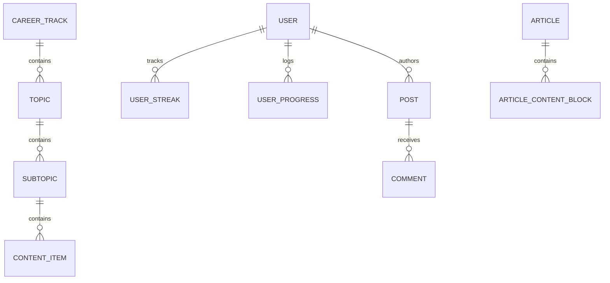

# GrindGram Comprehensive Data Architecture & Domain Model

**Target Domain:** `https://grindgram.in/`  
**Database Backend:** PostgreSQL (hosted on Supabase)  

---

## 1. Domain Entities & Schema Definitions



### Entity 1: `CareerTrack`
Represents high-level curriculums, cheatsheets, or calendar feeds.
* `id` (`UUID`, Primary Key): Unique identifier.
* `slug` (`VARCHAR(255)`, Unique): URL route identifier (e.g. `curious-coding-sheet`).
* `title` (`VARCHAR(255)`): Public display title.
* `description` (`TEXT`): Overview marketing summary.
* `type` (`VARCHAR(50)`): Track archetype (e.g. `coding-sheet`, `cheatsheet`, `calendar`, `masterclass`).
* `image_url` (`VARCHAR(500)`): Cover graphic CDN URL.
* `estimated_duration` (`VARCHAR(50)`): Human-readable duration (e.g. `120 hours`, `30 days`).
* `level` (`VARCHAR(50)`): Skill target (`beginner`, `intermediate`, `advanced`).
* `is_premium` (`BOOLEAN`): Gate flag indicating whether Pro subscription is required.
* `is_featured` (`BOOLEAN`): Pinning flag for homepage display.
* `enrolled_count` (`INTEGER`): Public count of registered students.
* `rating` (`FLOAT`): Aggregated student review rating (e.g. `4.9`).
* `track_order` (`INTEGER`): Display precedence in catalogs.

### Entity 2: `Topic` (Pattern Group)
Represents a major algorithmic pattern or conceptual domain.
* `id` (`UUID`, Primary Key): Identifier.
* `track_id` (`UUID`, Foreign Key): Associated career track.
* `title` (`VARCHAR(255)`): Topic name (e.g. `Array - Data structure`, `Sliding Window - Technique`).
* `description` (`TEXT`): Theoretical pattern overview.
* `difficulty` (`VARCHAR(50)`): Topic difficulty tier.
* `topic_order` (`INTEGER`): Display sequence inside parent track.

### Entity 3: `Subtopic` (Pattern Variation)
Represents a specific category of problems under a pattern.
* `id` (`UUID`, Primary Key): Identifier.
* `topic_id` (`UUID`, Foreign Key): Parent topic identifier.
* `title` (`VARCHAR(255)`): Subtopic title (e.g. `Two Pointers Approach`, `Kadane's Algorithm`).
* `tutorial_link` (`VARCHAR(500)`): Direct external tutorial or article link.
* `video_link` (`VARCHAR(500)`): YouTube video walkthrough URL.
* `subtopic_order` (`INTEGER`): Order inside topic.

### Entity 4: `ContentItem` (Problem / Quiz / Opportunity)
Polymorphic entity representing a DSA problem, an aptitude quiz, or an internship opportunity.
* `id` (`UUID`, Primary Key): Identifier.
* `subtopic_id` (`UUID`, Foreign Key): Parent subtopic identifier.
* `title` (`VARCHAR(255)`): Problem or opportunity name.
* `content_type` (`VARCHAR(50)`): Discriminator: `problem`, `quiz`, `enhanced-table`, `paragraph`, `code`.
* `difficulty` (`VARCHAR(50)`): `easy`, `medium`, `hard`.
* `xp_reward` (`INTEGER`): Points awarded upon completion (e.g. 5, 10, 15 XP).
* `article_link` (`VARCHAR(500)`): Primary practice link (LeetCode/GFG) or corporate apply link.
* `resource_link` (`VARCHAR(500)`): Direct video tutorial URL.
* `hint` (`TEXT`): Solution hint or conceptual article URL.
* `content_info` (`JSONB`): Flexible schema holding quiz payloads (questions, options, explanations) or job records (salary, batch, deadline, requirements).
* `content_order` (`INTEGER`): Sort order in subtopic.

### Entity 5: `Article`
Editorial articles and guides.
* `id` (`UUID`, Primary Key): Identifier.
* `slug` / `unique_title` (`VARCHAR(255)`): Canonical slug.
* `title` (`VARCHAR(255)`): Editorial headline.
* `excerpt` (`TEXT`): Teaser summary.
* `category` (`VARCHAR(50)`): `career` or `technical`.
* `difficulty_level` (`VARCHAR(50)`): `beginner`, `intermediate`, `advanced`.
* `reading_time_minutes` (`INTEGER`): Duration (e.g. 10, 14, 15).
* `author_id` (`UUID`, Foreign Key): Author reference.
* `published_at` (`TIMESTAMPTZ`): Public release timestamp.
* `article_content_blocks` (`JSONB`): Serialized content blocks (paragraphs, callouts, checklists, code).

### Entity 6: `InterviewExperience`
Crowdsourced interview debriefs.
* `id` (`UUID`, Primary Key): Identifier.
* `company_name` (`VARCHAR(100)`): E.g. `Google`, `Amazon`, `TCS`.
* `role` (`VARCHAR(100)`): E.g. `Software Development Engineer - Intern`.
* `interview_type` (`VARCHAR(50)`): `Internship` or `Full Time`.
* `outcome` (`VARCHAR(50)`): `Selected`, `Rejected`.
* `rounds_data` (`JSONB`): Round details, questions asked, and preparation advice.

### Entity 7: `UserStreak & Leaderboard`
Gamification telemetry tracking active student practice.
* `user_id` (`UUID`, Foreign Key): Supabase user.
* `streak_count` (`INTEGER`): Consecutive days logged in (e.g. `265 days`).
* `total_xp` (`INTEGER`): Cumulative points earned.
* `college_name` (`VARCHAR(255)`): Institutional affiliation for campus leaderboards.

---

## 2. Sample Records (Real Extracted Data)

### Sample 1: `CareerTrack`
```json
{
  "id": "7a892b12-9c34-4e56-b789-0123456789ab",
  "slug": "curious-coding-sheet",
  "title": "Curious Freaks Coding Sheet",
  "description": "Master Coding — 50 patterns to crack your dream SDE Job.",
  "type": "coding-sheet",
  "level": "intermediate",
  "enrolled_count": 25000,
  "rating": 4.9,
  "is_premium": false,
  "is_featured": true
}
```

### Sample 2: `ContentItem` (DSA Problem)
```json
{
  "id": "6371ef94-1e48-4c1e-ae01-2428ded4f567",
  "title": "Find even or odd",
  "content_type": "article",
  "difficulty": "medium",
  "xp_reward": 5,
  "article_link": "https://practice.geeksforgeeks.org/problems/odd-or-even3618/1",
  "hint": "https://www.geeksforgeeks.org/dsa/check-whether-given-number-even-odd/",
  "resource_link": "https://www.youtube.com/watch?v=...",
  "content_order": 1
}
```

### Sample 3: `ContentItem` (Aptitude Quiz Question)
```json
{
  "id": "b6fa8013-3741-48d4-a05f-2f64c14520da",
  "title": "Round Trip Average Speed",
  "content_type": "quiz",
  "difficulty": "medium",
  "xp_reward": 15,
  "question": "A person covers a distance of 60 km from P to Q at a speed of 20 km/hr and returns from Q to P at a speed of 30 km/hr. Find the average speed of person.",
  "options": [
    {"id": "a", "text": "22 km/hr"},
    {"id": "b", "text": "24 km/hr"},
    {"id": "c", "text": "26 km/hr"},
    {"id": "d", "text": "28.2 km/hr"}
  ],
  "correctAnswer": 1,
  "explanation": "Total distance = 120 km. Total time = 3 + 2 = 5 hrs. Avg speed = 120 / 5 = 24 km/hr."
}
```

### Sample 4: `ContentItem` (Off-Campus Hiring Record)
```json
{
  "id": "ebfd196d-0b7b-4e45-b402-d6fe25e2f2a8",
  "title": "Barclays Off-Campus Hiring",
  "content_type": "enhanced-table",
  "companyName": "Barclays",
  "position": "SDE / New Grad",
  "batch": "2024, 2025, 2026",
  "applyUrl": "https://home.barclays/careers",
  "salaryRange": {"min": 1600000, "max": 2000000, "currency": "INR", "period": "annual"},
  "interviewProcess": ["Round 1: MCQ + Coding test", "Round 2: Technical + HR interview"]
}
```

---

## 3. Cheatsheet Pattern-to-Problem Mapping (Curious Coding Sheet)

The Curious Freaks Coding Sheet indexes **18 core algorithmic topics (50 patterns) covering 413 problems**:

| Pattern # | Pattern / Topic Name | Scope & Algorithmic Summary | Problem Count | Sample Mapped Problems & Platform Links |
|---|---|---|---|---|
| **01** | **Basics** | Foundational math, digit extraction, palindromes, primes, and basic GCD. | 18 | `Find even or odd` ([GFG](https://practice.geeksforgeeks.org/problems/odd-or-even3618/1)), `Reverse a number` ([GFG](https://www.geeksforgeeks.org/problems/reverse-digit0316/1)) |
| **02** | **Array - Data structure** | Array traversal, two-pointer techniques, prefix sums, Kadane's algorithm, and hashing. | 42 | `Contains Duplicate` ([LeetCode](https://leetcode.com/problems/contains-duplicate/description)), `Sort an Array` ([LeetCode](https://leetcode.com/problems/sort-an-array/description)) |
| **03** | **Time & Space Complexity** | Asymptotic analysis, Big-O notation, master theorem, and auxiliary memory trade-offs. | 12 | Conceptual analysis and practice problems |
| **04** | **Matrix - Data structure** | 2D array traversal, spiral matrix, matrix rotation, row-wise/column-wise binary search. | 16 | Matrix traversal and search challenges on GFG and LeetCode |
| **05** | **Binary Search - Algorithm** | Search in sorted spaces, lower/upper bounds, rotated arrays, and binary search on answers. | 28 | `Binary Search` ([LeetCode](https://leetcode.com/problems/binary-search/description/)), `Search Insert Position` ([LeetCode](https://leetcode.com/problems/search-insert-position/description/)) |
| **06** | **Sorting - Algorithm** | Merge Sort, Quick Sort, Count Sort, custom comparators, and inversion counts. | 15 | Sorting fundamentals and array partitions |
| **07** | **Linked List - Data structure** | Single/doubly linked lists, cycle detection (Floyd's algorithm), reversal, and LRU Cache. | 32 | `Reverse Linked List` ([LeetCode](https://leetcode.com/problems/reverse-linked-list/description)), `LRU Cache` ([LeetCode](https://leetcode.com/problems/lru-cache/description/)) |
| **08** | **Stack - Data structure** | Monotonic stack, Next Greater Element, balanced parentheses, and min-stack. | 24 | `Minimum Add to Make Parentheses Valid` ([LeetCode](https://leetcode.com/problems/minimum-add-to-make-parentheses-valid/description/)) |
| **09** | **Queue - Data structure** | FIFO buffers, circular queues, deque, sliding window maximum. | 18 | Queue operations and sliding window queues |
| **10** | **Tree - Data structure** | Binary trees, BST, BFS level-order, DFS traversals (pre, in, post), and LCA. | 45 | `Binary Tree Inorder Traversal` ([LeetCode](https://leetcode.com/problems/binary-tree-inorder-traversal/description)), `Lowest Common Ancestor` ([LeetCode](https://leetcode.com/problems/lowest-common-ancestor-of-a-binary-tree/description/)) |
| **11** | **Sliding Window - Technique** | Fixed and variable-size sliding window, longest substring without repeating characters. | 22 | `Longest Substring Without Repeating Characters` ([LeetCode](https://leetcode.com/problems/longest-substring-without-repeating-characters/description)) |
| **12** | **Graph - Data structure** | Adjacency lists, BFS, DFS, Dijkstra, Bellman-Ford, topological sort, and Disjoint Set Union. | 36 | `Rotting Oranges` ([LeetCode](https://leetcode.com/problems/rotting-oranges/description)), Connected components |
| **13** | **Backtracking & Recursion** | Subsets, combinations, permutations, N-Queens, Sudoku solver, and pathfinding. | 25 | `Subsets` ([LeetCode](https://leetcode.com/problems/subsets/description)) |
| **14** | **Greedy - Technique** | Interval scheduling, activity selection, fractional knapsack, gas station, and jump game. | 20 | `Merge Intervals` ([LeetCode](https://leetcode.com/problems/merge-intervals/description)), `Non-overlapping Intervals` ([LeetCode](https://leetcode.com/problems/non-overlapping-intervals/description/)) |
| **15** | **Dynamic Programming** | 1D and 2D DP, Memoization, Tabulation, Knapsack variations, LCS, LIS, and Matrix Chain. | 48 | `Longest Common Subsequence` ([LeetCode](https://leetcode.com/problems/longest-common-subsequence/description/)), `Longest Increasing Subsequence` ([LeetCode](https://leetcode.com/problems/longest-increasing-subsequence/description/)) |
| **16** | **Heaps - Data structure** | Min-Heap, Max-Heap, Priority Queue, Top K Frequent Elements, median from data stream. | 16 | `Top K Frequent Elements` ([LeetCode](https://leetcode.com/problems/top-k-frequent-elements/description)) |
| **17** | **Trie - Data structure** | Prefix trees, autocomplete systems, word search II, and bitwise XOR tries. | 12 | Prefix matching and word search problems |
| **18** | **String** | String hashing, KMP algorithm, Rabin-Karp, anagrams, and palindrome substrings. | 25 | `Valid Anagram`, `Longest Palindromic Substring` |
