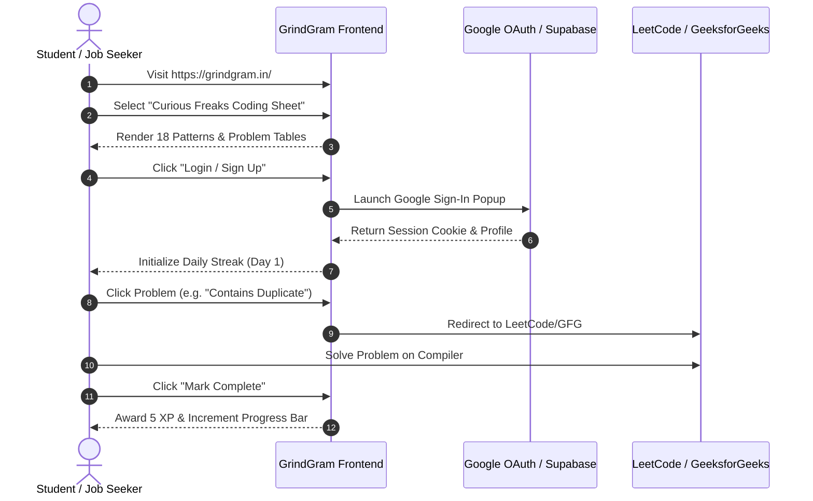

# GrindGram User Features Matrix & Workflow Analysis

**Target Domain:** `https://grindgram.in/`  

---

## 1. User-Facing Feature Matrix

| Feature Area | Specific Functionality | Access Tier | User Value Proposition |
|---|---|---|---|
| **Career Tracks & DSA Sheets** | 18 topics, 50 patterns, 413 problems with LeetCode/GFG links, difficulty badges, and video links. | **Free (Public)** | Structured, pattern-first coding interview preparation without wandering. |
| **Interactive Aptitude Cheatsheet** | 18 quantitative topics, 252 interactive MCQs with instant answer validation and step-by-step math explanations. | **Free (Public)** | Eliminates reliance on textbooks; fast self-assessment for placement screening. |
| **SQL Masterclass & Interview Sheet** | Comprehensive database curriculum + 136 query challenges with schema diagrams and SQL solutions. | **Free (Public)** | Practical SQL mastery for data and software engineering roles. |
| **Recruitment Calendars (2026)** | 50+ SDE internships and 73+ off-campus drives with stipend, batch eligibility, and direct apply links. | **Free (Public)** | Centralized hiring aggregator preventing missed application deadlines. |
| **Editorial Career & Tech Guides** | 7 long-form guides covering internships, Google STEP, System Design, AI, and Higher Studies vs Jobs. | **Free (Public)** | High-quality career advisory bridging the tier-3 to product company gap. |
| **Placement Readiness Diagnostic** | 90-minute timed diagnostic test across DSA, Quantitative Aptitude, and CS Core. | **Free (Public)** | Quantifies real readiness before facing actual college placement tests. |
| **TCS NQT Simulation** | 90-minute timed test modeled after national TCS National Qualifier Test format. | **Free (Public)** | Practice under exam conditions with sectional timing. |
| **Daily Streak & Gamification** | Streak flame counter, Daily Inspiration quotes, Streak Champions, and Top Campus leaderboards. | **Free (Requires Login)** | Habits formation and healthy campus competition. |
| **Community Feed & Discussions** | Campus diaries, student success stories, and career questions. | **Free (Read Public / Write Gated)** | Peer-to-peer student support and networking. |
| **Institutional B2B Partnership** | Placement diagnostics, curriculum MoUs, live trainer bootcamps for Colleges & TPOs. | **Institutional** | Upskills entire college batches and boosts institutional placement statistics. |
| **GrindGram Pro Tier** | Advanced AI mock interviews, detailed code feedback, and premium roadmaps. | **Gated (Pro / Login Required)** | Accelerated 1-on-1 interview preparation. |

---

## 2. Core User Workflows

### Key Workflow Breakdown:
1. **The Study & Solve Flow:** User browses by pattern $
ightarrow$ reads subtopic tutorial $
ightarrow$ clicks problem link $
ightarrow$ solves on LeetCode/GFG $
ightarrow$ marks complete on GrindGram $
ightarrow$ gains XP.
2. **The Aptitude Practice Flow:** User chooses topic (e.g. Speed & Distance) $
ightarrow$ reads formula $
ightarrow$ solves interactive question $
ightarrow$ clicks option $
ightarrow$ verifies step-by-step explanation.
3. **The Hiring Application Flow:** User visits Internship or Offcampus Calendar $
ightarrow$ filters by batch (2026) $
ightarrow$ reviews package and requirements $
ightarrow$ clicks direct career link to apply.
4. **The Institutional TPO Flow:** Placement Director visits `/partnership` $
ightarrow$ reviews placement gap analysis $
ightarrow$ books institutional demo $
ightarrow$ schedules campus diagnostic drive.
